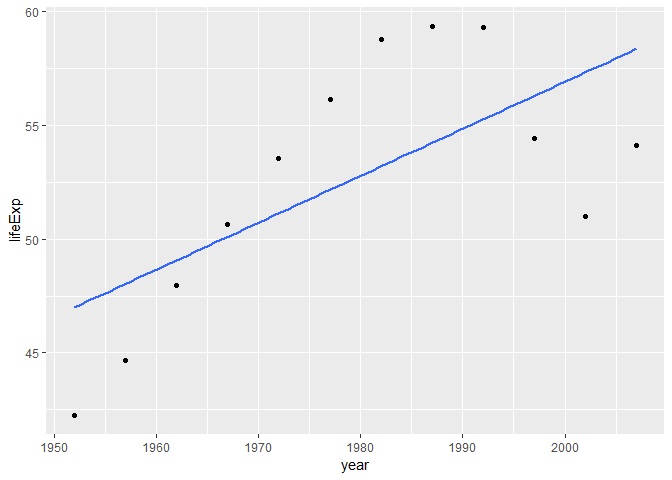

#### Load the gapminder data set


Load the Gapminder data set and also load ggplot2 so that plots can be made.


```r
library(gapminder)
library(ggplot2)
suppressPackageStartupMessages(library(dplyr))
suppressPackageStartupMessages(library(tidyverse))
suppressPackageStartupMessages(library(stringr))
suppressPackageStartupMessages(library(forcats))
suppressPackageStartupMessages(library(purrr))
suppressPackageStartupMessages(library(repurrrsive))
```


The following two tasks were performed for this homework:


#### **Task1: Read and work the exercises in the Strings chapter or R for Data Science**


**Exercise: 14.2.5**


**1. In code that doesn’t use stringr, you’ll often see paste() and paste0(). What’s the difference between the two functions? What stringr function are they equivalent to? How do the functions differ in their handling of `NA`?**


`Answer`: The difference between `paste()` and `paste0()` is that paste() uses space between two strings while paste0() does not. They are equivalent to `str_c()` function. If either paste() or paste0() is used with NA, then `NA` becomes the part of the string but with `str_c()`, the output itself is NA. 'For example:`


```r
paste("Divta", "Pal")
```

```
## [1] "Divta Pal"
```


```r
paste0("Divta", "Pal")
```

```
## [1] "DivtaPal"
```


```r
str_c("DivitaPal", NA)
```

```
## [1] NA
```


```r
paste("DivitaPal", NA)
```

```
## [1] "DivitaPal NA"
```


**2. In your own words, describe the difference between the sep and collapse arguments to str_c().**


`Answer`: The `sep` function seperates two or more strings whereas `collapse` function combines two or more strings into one single string. `For example:`


```r
str_c("x", "y", sep = ",")
```

```
## [1] "x,y"
```

```r
str_c("x","y", collapse = ",")
```

```
## [1] "xy"
```


**3. Use str_length() and str_sub() to extract the middle character from a string. What will you do if the string has an even number of characters?**


`Answer:`


```r
name <- 'Divita' #length of string is even

str_sub(name,str_length(name)/2, str_length(name)/2+1 )
```

```
## [1] "vi"
```


**4. What does str_wrap() do? When might you want to use it?**

`Answer:` The function `str_wrap()` seperate one paragraph into number of lines.


```r
paragraph <- "R is a programming language and free software environment for statistical computing and graphics supported by the R Foundation for Statistical Computing. The R language is widely used among statisticians and data miners for developing statistical software and data analysis."

str_wrap(paragraph)
```

```
## [1] "R is a programming language and free software environment for statistical\ncomputing and graphics supported by the R Foundation for Statistical Computing.\nThe R language is widely used among statisticians and data miners for developing\nstatistical software and data analysis."
```


**5. What does str_trim() do? What’s the opposite of str_trim()?**


`Answer:` It deletes TAB, heading and tailing spaces in a string.


**Exercise: 14.3.1.1**


**1. Explain why each of these strings don’t match a \: "\", "\\", "\\\".**


`Answer:` `\` is used as an escape character. '\\' is used as an escape charater `\` followed by a backslash `\` which means a single backslash. `\\\` is used a backslash followed by an escape charater followed by a backslash which is again used as a backslash.


**2. How would you match the sequence "'\?**


`Answer:` In order to match the sequence, the character needs to be enclosed within double coats and then the double coats needs to be escaped by backslash `\"'\"`


**Exercise: 14.3.2.1**


**1. How would you match the literal string "$^$"?**


`Answer:` We need to use the character `\\$\\^\\$` to match the string. `For example"`


```r
str_view("Divita$^$Pal", pattern="\\$\\^\\$", match = TRUE)
```

<!--html_preserve--><div id="htmlwidget-215858b6ec6109a54e99" style="width:960px;height:100%;" class="str_view html-widget"></div>
<script type="application/json" data-for="htmlwidget-215858b6ec6109a54e99">{"x":{"html":"<ul>\n  <li>Divita<span class='match'>$^$<\/span>Pal<\/li>\n<\/ul>"},"evals":[],"jsHooks":[]}</script><!--/html_preserve-->


**2. Given the corpus of common words in stringr::words, create regular expressions that find all words that:**

`Start with “y”`


```r
str_view(stringr::words, pattern = "^y", match = TRUE)
```

<!--html_preserve--><div id="htmlwidget-5a148461f4e5d7fd8940" style="width:960px;height:100%;" class="str_view html-widget"></div>
<script type="application/json" data-for="htmlwidget-5a148461f4e5d7fd8940">{"x":{"html":"<ul>\n  <li><span class='match'>y<\/span>ear<\/li>\n  <li><span class='match'>y<\/span>es<\/li>\n  <li><span class='match'>y<\/span>esterday<\/li>\n  <li><span class='match'>y<\/span>et<\/li>\n  <li><span class='match'>y<\/span>ou<\/li>\n  <li><span class='match'>y<\/span>oung<\/li>\n<\/ul>"},"evals":[],"jsHooks":[]}</script><!--/html_preserve-->


`End with x`


```r
str_view(stringr::words, pattern = "x$", match = TRUE)
```

<!--html_preserve--><div id="htmlwidget-8b4ab22f9ade51d415e7" style="width:960px;height:100%;" class="str_view html-widget"></div>
<script type="application/json" data-for="htmlwidget-8b4ab22f9ade51d415e7">{"x":{"html":"<ul>\n  <li>bo<span class='match'>x<\/span><\/li>\n  <li>se<span class='match'>x<\/span><\/li>\n  <li>si<span class='match'>x<\/span><\/li>\n  <li>ta<span class='match'>x<\/span><\/li>\n<\/ul>"},"evals":[],"jsHooks":[]}</script><!--/html_preserve-->

`Are exactly three letters long`


```r
str_view(stringr::words, pattern = "^.{3}$", match = TRUE)
```

<!--html_preserve--><div id="htmlwidget-2633668de37ce801ccad" style="width:960px;height:100%;" class="str_view html-widget"></div>
<script type="application/json" data-for="htmlwidget-2633668de37ce801ccad">{"x":{"html":"<ul>\n  <li><span class='match'>act<\/span><\/li>\n  <li><span class='match'>add<\/span><\/li>\n  <li><span class='match'>age<\/span><\/li>\n  <li><span class='match'>ago<\/span><\/li>\n  <li><span class='match'>air<\/span><\/li>\n  <li><span class='match'>all<\/span><\/li>\n  <li><span class='match'>and<\/span><\/li>\n  <li><span class='match'>any<\/span><\/li>\n  <li><span class='match'>arm<\/span><\/li>\n  <li><span class='match'>art<\/span><\/li>\n  <li><span class='match'>ask<\/span><\/li>\n  <li><span class='match'>bad<\/span><\/li>\n  <li><span class='match'>bag<\/span><\/li>\n  <li><span class='match'>bar<\/span><\/li>\n  <li><span class='match'>bed<\/span><\/li>\n  <li><span class='match'>bet<\/span><\/li>\n  <li><span class='match'>big<\/span><\/li>\n  <li><span class='match'>bit<\/span><\/li>\n  <li><span class='match'>box<\/span><\/li>\n  <li><span class='match'>boy<\/span><\/li>\n  <li><span class='match'>bus<\/span><\/li>\n  <li><span class='match'>but<\/span><\/li>\n  <li><span class='match'>buy<\/span><\/li>\n  <li><span class='match'>can<\/span><\/li>\n  <li><span class='match'>car<\/span><\/li>\n  <li><span class='match'>cat<\/span><\/li>\n  <li><span class='match'>cup<\/span><\/li>\n  <li><span class='match'>cut<\/span><\/li>\n  <li><span class='match'>dad<\/span><\/li>\n  <li><span class='match'>day<\/span><\/li>\n  <li><span class='match'>die<\/span><\/li>\n  <li><span class='match'>dog<\/span><\/li>\n  <li><span class='match'>dry<\/span><\/li>\n  <li><span class='match'>due<\/span><\/li>\n  <li><span class='match'>eat<\/span><\/li>\n  <li><span class='match'>egg<\/span><\/li>\n  <li><span class='match'>end<\/span><\/li>\n  <li><span class='match'>eye<\/span><\/li>\n  <li><span class='match'>far<\/span><\/li>\n  <li><span class='match'>few<\/span><\/li>\n  <li><span class='match'>fit<\/span><\/li>\n  <li><span class='match'>fly<\/span><\/li>\n  <li><span class='match'>for<\/span><\/li>\n  <li><span class='match'>fun<\/span><\/li>\n  <li><span class='match'>gas<\/span><\/li>\n  <li><span class='match'>get<\/span><\/li>\n  <li><span class='match'>god<\/span><\/li>\n  <li><span class='match'>guy<\/span><\/li>\n  <li><span class='match'>hit<\/span><\/li>\n  <li><span class='match'>hot<\/span><\/li>\n  <li><span class='match'>how<\/span><\/li>\n  <li><span class='match'>job<\/span><\/li>\n  <li><span class='match'>key<\/span><\/li>\n  <li><span class='match'>kid<\/span><\/li>\n  <li><span class='match'>lad<\/span><\/li>\n  <li><span class='match'>law<\/span><\/li>\n  <li><span class='match'>lay<\/span><\/li>\n  <li><span class='match'>leg<\/span><\/li>\n  <li><span class='match'>let<\/span><\/li>\n  <li><span class='match'>lie<\/span><\/li>\n  <li><span class='match'>lot<\/span><\/li>\n  <li><span class='match'>low<\/span><\/li>\n  <li><span class='match'>man<\/span><\/li>\n  <li><span class='match'>may<\/span><\/li>\n  <li><span class='match'>mrs<\/span><\/li>\n  <li><span class='match'>new<\/span><\/li>\n  <li><span class='match'>non<\/span><\/li>\n  <li><span class='match'>not<\/span><\/li>\n  <li><span class='match'>now<\/span><\/li>\n  <li><span class='match'>odd<\/span><\/li>\n  <li><span class='match'>off<\/span><\/li>\n  <li><span class='match'>old<\/span><\/li>\n  <li><span class='match'>one<\/span><\/li>\n  <li><span class='match'>out<\/span><\/li>\n  <li><span class='match'>own<\/span><\/li>\n  <li><span class='match'>pay<\/span><\/li>\n  <li><span class='match'>per<\/span><\/li>\n  <li><span class='match'>put<\/span><\/li>\n  <li><span class='match'>red<\/span><\/li>\n  <li><span class='match'>rid<\/span><\/li>\n  <li><span class='match'>run<\/span><\/li>\n  <li><span class='match'>say<\/span><\/li>\n  <li><span class='match'>see<\/span><\/li>\n  <li><span class='match'>set<\/span><\/li>\n  <li><span class='match'>sex<\/span><\/li>\n  <li><span class='match'>she<\/span><\/li>\n  <li><span class='match'>sir<\/span><\/li>\n  <li><span class='match'>sit<\/span><\/li>\n  <li><span class='match'>six<\/span><\/li>\n  <li><span class='match'>son<\/span><\/li>\n  <li><span class='match'>sun<\/span><\/li>\n  <li><span class='match'>tax<\/span><\/li>\n  <li><span class='match'>tea<\/span><\/li>\n  <li><span class='match'>ten<\/span><\/li>\n  <li><span class='match'>the<\/span><\/li>\n  <li><span class='match'>tie<\/span><\/li>\n  <li><span class='match'>too<\/span><\/li>\n  <li><span class='match'>top<\/span><\/li>\n  <li><span class='match'>try<\/span><\/li>\n  <li><span class='match'>two<\/span><\/li>\n  <li><span class='match'>use<\/span><\/li>\n  <li><span class='match'>war<\/span><\/li>\n  <li><span class='match'>way<\/span><\/li>\n  <li><span class='match'>wee<\/span><\/li>\n  <li><span class='match'>who<\/span><\/li>\n  <li><span class='match'>why<\/span><\/li>\n  <li><span class='match'>win<\/span><\/li>\n  <li><span class='match'>yes<\/span><\/li>\n  <li><span class='match'>yet<\/span><\/li>\n  <li><span class='match'>you<\/span><\/li>\n<\/ul>"},"evals":[],"jsHooks":[]}</script><!--/html_preserve-->

`Have seven letters or more`


```r
str_view(stringr::words, pattern = "\\b.......", match = TRUE)
```

<!--html_preserve--><div id="htmlwidget-6c5bb684b65308344f5a" style="width:960px;height:100%;" class="str_view html-widget"></div>
<script type="application/json" data-for="htmlwidget-6c5bb684b65308344f5a">{"x":{"html":"<ul>\n  <li><span class='match'>absolut<\/span>e<\/li>\n  <li><span class='match'>account<\/span><\/li>\n  <li><span class='match'>achieve<\/span><\/li>\n  <li><span class='match'>address<\/span><\/li>\n  <li><span class='match'>adverti<\/span>se<\/li>\n  <li><span class='match'>afterno<\/span>on<\/li>\n  <li><span class='match'>against<\/span><\/li>\n  <li><span class='match'>already<\/span><\/li>\n  <li><span class='match'>alright<\/span><\/li>\n  <li><span class='match'>althoug<\/span>h<\/li>\n  <li><span class='match'>america<\/span><\/li>\n  <li><span class='match'>another<\/span><\/li>\n  <li><span class='match'>apparen<\/span>t<\/li>\n  <li><span class='match'>appoint<\/span><\/li>\n  <li><span class='match'>approac<\/span>h<\/li>\n  <li><span class='match'>appropr<\/span>iate<\/li>\n  <li><span class='match'>arrange<\/span><\/li>\n  <li><span class='match'>associa<\/span>te<\/li>\n  <li><span class='match'>authori<\/span>ty<\/li>\n  <li><span class='match'>availab<\/span>le<\/li>\n  <li><span class='match'>balance<\/span><\/li>\n  <li><span class='match'>because<\/span><\/li>\n  <li><span class='match'>believe<\/span><\/li>\n  <li><span class='match'>benefit<\/span><\/li>\n  <li><span class='match'>between<\/span><\/li>\n  <li><span class='match'>brillia<\/span>nt<\/li>\n  <li><span class='match'>britain<\/span><\/li>\n  <li><span class='match'>brother<\/span><\/li>\n  <li><span class='match'>busines<\/span>s<\/li>\n  <li><span class='match'>certain<\/span><\/li>\n  <li><span class='match'>chairma<\/span>n<\/li>\n  <li><span class='match'>charact<\/span>er<\/li>\n  <li><span class='match'>Christm<\/span>as<\/li>\n  <li><span class='match'>colleag<\/span>ue<\/li>\n  <li><span class='match'>collect<\/span><\/li>\n  <li><span class='match'>college<\/span><\/li>\n  <li><span class='match'>comment<\/span><\/li>\n  <li><span class='match'>committ<\/span>ee<\/li>\n  <li><span class='match'>communi<\/span>ty<\/li>\n  <li><span class='match'>company<\/span><\/li>\n  <li><span class='match'>compare<\/span><\/li>\n  <li><span class='match'>complet<\/span>e<\/li>\n  <li><span class='match'>compute<\/span><\/li>\n  <li><span class='match'>concern<\/span><\/li>\n  <li><span class='match'>conditi<\/span>on<\/li>\n  <li><span class='match'>conside<\/span>r<\/li>\n  <li><span class='match'>consult<\/span><\/li>\n  <li><span class='match'>contact<\/span><\/li>\n  <li><span class='match'>continu<\/span>e<\/li>\n  <li><span class='match'>contrac<\/span>t<\/li>\n  <li><span class='match'>control<\/span><\/li>\n  <li><span class='match'>convers<\/span>e<\/li>\n  <li><span class='match'>correct<\/span><\/li>\n  <li><span class='match'>council<\/span><\/li>\n  <li><span class='match'>country<\/span><\/li>\n  <li><span class='match'>current<\/span><\/li>\n  <li><span class='match'>decisio<\/span>n<\/li>\n  <li><span class='match'>definit<\/span>e<\/li>\n  <li><span class='match'>departm<\/span>ent<\/li>\n  <li><span class='match'>describ<\/span>e<\/li>\n  <li><span class='match'>develop<\/span><\/li>\n  <li><span class='match'>differe<\/span>nce<\/li>\n  <li><span class='match'>difficu<\/span>lt<\/li>\n  <li><span class='match'>discuss<\/span><\/li>\n  <li><span class='match'>distric<\/span>t<\/li>\n  <li><span class='match'>documen<\/span>t<\/li>\n  <li><span class='match'>economy<\/span><\/li>\n  <li><span class='match'>educate<\/span><\/li>\n  <li><span class='match'>electri<\/span>c<\/li>\n  <li><span class='match'>encoura<\/span>ge<\/li>\n  <li><span class='match'>english<\/span><\/li>\n  <li><span class='match'>environ<\/span>ment<\/li>\n  <li><span class='match'>especia<\/span>l<\/li>\n  <li><span class='match'>evening<\/span><\/li>\n  <li><span class='match'>evidenc<\/span>e<\/li>\n  <li><span class='match'>example<\/span><\/li>\n  <li><span class='match'>exercis<\/span>e<\/li>\n  <li><span class='match'>expense<\/span><\/li>\n  <li><span class='match'>experie<\/span>nce<\/li>\n  <li><span class='match'>explain<\/span><\/li>\n  <li><span class='match'>express<\/span><\/li>\n  <li><span class='match'>finance<\/span><\/li>\n  <li><span class='match'>fortune<\/span><\/li>\n  <li><span class='match'>forward<\/span><\/li>\n  <li><span class='match'>functio<\/span>n<\/li>\n  <li><span class='match'>further<\/span><\/li>\n  <li><span class='match'>general<\/span><\/li>\n  <li><span class='match'>germany<\/span><\/li>\n  <li><span class='match'>goodbye<\/span><\/li>\n  <li><span class='match'>history<\/span><\/li>\n  <li><span class='match'>holiday<\/span><\/li>\n  <li><span class='match'>hospita<\/span>l<\/li>\n  <li><span class='match'>however<\/span><\/li>\n  <li><span class='match'>hundred<\/span><\/li>\n  <li><span class='match'>husband<\/span><\/li>\n  <li><span class='match'>identif<\/span>y<\/li>\n  <li><span class='match'>imagine<\/span><\/li>\n  <li><span class='match'>importa<\/span>nt<\/li>\n  <li><span class='match'>improve<\/span><\/li>\n  <li><span class='match'>include<\/span><\/li>\n  <li><span class='match'>increas<\/span>e<\/li>\n  <li><span class='match'>individ<\/span>ual<\/li>\n  <li><span class='match'>industr<\/span>y<\/li>\n  <li><span class='match'>instead<\/span><\/li>\n  <li><span class='match'>interes<\/span>t<\/li>\n  <li><span class='match'>introdu<\/span>ce<\/li>\n  <li><span class='match'>involve<\/span><\/li>\n  <li><span class='match'>kitchen<\/span><\/li>\n  <li><span class='match'>languag<\/span>e<\/li>\n  <li><span class='match'>machine<\/span><\/li>\n  <li><span class='match'>meaning<\/span><\/li>\n  <li><span class='match'>measure<\/span><\/li>\n  <li><span class='match'>mention<\/span><\/li>\n  <li><span class='match'>million<\/span><\/li>\n  <li><span class='match'>ministe<\/span>r<\/li>\n  <li><span class='match'>morning<\/span><\/li>\n  <li><span class='match'>necessa<\/span>ry<\/li>\n  <li><span class='match'>obvious<\/span><\/li>\n  <li><span class='match'>occasio<\/span>n<\/li>\n  <li><span class='match'>operate<\/span><\/li>\n  <li><span class='match'>opportu<\/span>nity<\/li>\n  <li><span class='match'>organiz<\/span>e<\/li>\n  <li><span class='match'>origina<\/span>l<\/li>\n  <li><span class='match'>otherwi<\/span>se<\/li>\n  <li><span class='match'>paragra<\/span>ph<\/li>\n  <li><span class='match'>particu<\/span>lar<\/li>\n  <li><span class='match'>pension<\/span><\/li>\n  <li><span class='match'>percent<\/span><\/li>\n  <li><span class='match'>perfect<\/span><\/li>\n  <li><span class='match'>perhaps<\/span><\/li>\n  <li><span class='match'>photogr<\/span>aph<\/li>\n  <li><span class='match'>picture<\/span><\/li>\n  <li><span class='match'>politic<\/span><\/li>\n  <li><span class='match'>positio<\/span>n<\/li>\n  <li><span class='match'>positiv<\/span>e<\/li>\n  <li><span class='match'>possibl<\/span>e<\/li>\n  <li><span class='match'>practis<\/span>e<\/li>\n  <li><span class='match'>prepare<\/span><\/li>\n  <li><span class='match'>present<\/span><\/li>\n  <li><span class='match'>pressur<\/span>e<\/li>\n  <li><span class='match'>presume<\/span><\/li>\n  <li><span class='match'>previou<\/span>s<\/li>\n  <li><span class='match'>private<\/span><\/li>\n  <li><span class='match'>probabl<\/span>e<\/li>\n  <li><span class='match'>problem<\/span><\/li>\n  <li><span class='match'>proceed<\/span><\/li>\n  <li><span class='match'>process<\/span><\/li>\n  <li><span class='match'>produce<\/span><\/li>\n  <li><span class='match'>product<\/span><\/li>\n  <li><span class='match'>program<\/span>me<\/li>\n  <li><span class='match'>project<\/span><\/li>\n  <li><span class='match'>propose<\/span><\/li>\n  <li><span class='match'>protect<\/span><\/li>\n  <li><span class='match'>provide<\/span><\/li>\n  <li><span class='match'>purpose<\/span><\/li>\n  <li><span class='match'>quality<\/span><\/li>\n  <li><span class='match'>quarter<\/span><\/li>\n  <li><span class='match'>questio<\/span>n<\/li>\n  <li><span class='match'>realise<\/span><\/li>\n  <li><span class='match'>receive<\/span><\/li>\n  <li><span class='match'>recogni<\/span>ze<\/li>\n  <li><span class='match'>recomme<\/span>nd<\/li>\n  <li><span class='match'>relatio<\/span>n<\/li>\n  <li><span class='match'>remembe<\/span>r<\/li>\n  <li><span class='match'>represe<\/span>nt<\/li>\n  <li><span class='match'>require<\/span><\/li>\n  <li><span class='match'>researc<\/span>h<\/li>\n  <li><span class='match'>resourc<\/span>e<\/li>\n  <li><span class='match'>respect<\/span><\/li>\n  <li><span class='match'>respons<\/span>ible<\/li>\n  <li><span class='match'>saturda<\/span>y<\/li>\n  <li><span class='match'>science<\/span><\/li>\n  <li><span class='match'>scotlan<\/span>d<\/li>\n  <li><span class='match'>secreta<\/span>ry<\/li>\n  <li><span class='match'>section<\/span><\/li>\n  <li><span class='match'>separat<\/span>e<\/li>\n  <li><span class='match'>serious<\/span><\/li>\n  <li><span class='match'>service<\/span><\/li>\n  <li><span class='match'>similar<\/span><\/li>\n  <li><span class='match'>situate<\/span><\/li>\n  <li><span class='match'>society<\/span><\/li>\n  <li><span class='match'>special<\/span><\/li>\n  <li><span class='match'>specifi<\/span>c<\/li>\n  <li><span class='match'>standar<\/span>d<\/li>\n  <li><span class='match'>station<\/span><\/li>\n  <li><span class='match'>straigh<\/span>t<\/li>\n  <li><span class='match'>strateg<\/span>y<\/li>\n  <li><span class='match'>structu<\/span>re<\/li>\n  <li><span class='match'>student<\/span><\/li>\n  <li><span class='match'>subject<\/span><\/li>\n  <li><span class='match'>succeed<\/span><\/li>\n  <li><span class='match'>suggest<\/span><\/li>\n  <li><span class='match'>support<\/span><\/li>\n  <li><span class='match'>suppose<\/span><\/li>\n  <li><span class='match'>surpris<\/span>e<\/li>\n  <li><span class='match'>telepho<\/span>ne<\/li>\n  <li><span class='match'>televis<\/span>ion<\/li>\n  <li><span class='match'>terribl<\/span>e<\/li>\n  <li><span class='match'>therefo<\/span>re<\/li>\n  <li><span class='match'>thirtee<\/span>n<\/li>\n  <li><span class='match'>thousan<\/span>d<\/li>\n  <li><span class='match'>through<\/span><\/li>\n  <li><span class='match'>thursda<\/span>y<\/li>\n  <li><span class='match'>togethe<\/span>r<\/li>\n  <li><span class='match'>tomorro<\/span>w<\/li>\n  <li><span class='match'>tonight<\/span><\/li>\n  <li><span class='match'>traffic<\/span><\/li>\n  <li><span class='match'>transpo<\/span>rt<\/li>\n  <li><span class='match'>trouble<\/span><\/li>\n  <li><span class='match'>tuesday<\/span><\/li>\n  <li><span class='match'>underst<\/span>and<\/li>\n  <li><span class='match'>univers<\/span>ity<\/li>\n  <li><span class='match'>various<\/span><\/li>\n  <li><span class='match'>village<\/span><\/li>\n  <li><span class='match'>wednesd<\/span>ay<\/li>\n  <li><span class='match'>welcome<\/span><\/li>\n  <li><span class='match'>whether<\/span><\/li>\n  <li><span class='match'>without<\/span><\/li>\n  <li><span class='match'>yesterd<\/span>ay<\/li>\n<\/ul>"},"evals":[],"jsHooks":[]}</script><!--/html_preserve-->


**Exercise: 14.3.3.1**


**1. Create regular expressions to find all words that:**

`Answer:`


`Start with a vowel`


```r
str_view(stringr::words, pattern = "^[a|e|i|o|u]", match = TRUE)
```

<!--html_preserve--><div id="htmlwidget-1196b5a0d7bab47c96d7" style="width:960px;height:100%;" class="str_view html-widget"></div>
<script type="application/json" data-for="htmlwidget-1196b5a0d7bab47c96d7">{"x":{"html":"<ul>\n  <li><span class='match'>a<\/span><\/li>\n  <li><span class='match'>a<\/span>ble<\/li>\n  <li><span class='match'>a<\/span>bout<\/li>\n  <li><span class='match'>a<\/span>bsolute<\/li>\n  <li><span class='match'>a<\/span>ccept<\/li>\n  <li><span class='match'>a<\/span>ccount<\/li>\n  <li><span class='match'>a<\/span>chieve<\/li>\n  <li><span class='match'>a<\/span>cross<\/li>\n  <li><span class='match'>a<\/span>ct<\/li>\n  <li><span class='match'>a<\/span>ctive<\/li>\n  <li><span class='match'>a<\/span>ctual<\/li>\n  <li><span class='match'>a<\/span>dd<\/li>\n  <li><span class='match'>a<\/span>ddress<\/li>\n  <li><span class='match'>a<\/span>dmit<\/li>\n  <li><span class='match'>a<\/span>dvertise<\/li>\n  <li><span class='match'>a<\/span>ffect<\/li>\n  <li><span class='match'>a<\/span>fford<\/li>\n  <li><span class='match'>a<\/span>fter<\/li>\n  <li><span class='match'>a<\/span>fternoon<\/li>\n  <li><span class='match'>a<\/span>gain<\/li>\n  <li><span class='match'>a<\/span>gainst<\/li>\n  <li><span class='match'>a<\/span>ge<\/li>\n  <li><span class='match'>a<\/span>gent<\/li>\n  <li><span class='match'>a<\/span>go<\/li>\n  <li><span class='match'>a<\/span>gree<\/li>\n  <li><span class='match'>a<\/span>ir<\/li>\n  <li><span class='match'>a<\/span>ll<\/li>\n  <li><span class='match'>a<\/span>llow<\/li>\n  <li><span class='match'>a<\/span>lmost<\/li>\n  <li><span class='match'>a<\/span>long<\/li>\n  <li><span class='match'>a<\/span>lready<\/li>\n  <li><span class='match'>a<\/span>lright<\/li>\n  <li><span class='match'>a<\/span>lso<\/li>\n  <li><span class='match'>a<\/span>lthough<\/li>\n  <li><span class='match'>a<\/span>lways<\/li>\n  <li><span class='match'>a<\/span>merica<\/li>\n  <li><span class='match'>a<\/span>mount<\/li>\n  <li><span class='match'>a<\/span>nd<\/li>\n  <li><span class='match'>a<\/span>nother<\/li>\n  <li><span class='match'>a<\/span>nswer<\/li>\n  <li><span class='match'>a<\/span>ny<\/li>\n  <li><span class='match'>a<\/span>part<\/li>\n  <li><span class='match'>a<\/span>pparent<\/li>\n  <li><span class='match'>a<\/span>ppear<\/li>\n  <li><span class='match'>a<\/span>pply<\/li>\n  <li><span class='match'>a<\/span>ppoint<\/li>\n  <li><span class='match'>a<\/span>pproach<\/li>\n  <li><span class='match'>a<\/span>ppropriate<\/li>\n  <li><span class='match'>a<\/span>rea<\/li>\n  <li><span class='match'>a<\/span>rgue<\/li>\n  <li><span class='match'>a<\/span>rm<\/li>\n  <li><span class='match'>a<\/span>round<\/li>\n  <li><span class='match'>a<\/span>rrange<\/li>\n  <li><span class='match'>a<\/span>rt<\/li>\n  <li><span class='match'>a<\/span>s<\/li>\n  <li><span class='match'>a<\/span>sk<\/li>\n  <li><span class='match'>a<\/span>ssociate<\/li>\n  <li><span class='match'>a<\/span>ssume<\/li>\n  <li><span class='match'>a<\/span>t<\/li>\n  <li><span class='match'>a<\/span>ttend<\/li>\n  <li><span class='match'>a<\/span>uthority<\/li>\n  <li><span class='match'>a<\/span>vailable<\/li>\n  <li><span class='match'>a<\/span>ware<\/li>\n  <li><span class='match'>a<\/span>way<\/li>\n  <li><span class='match'>a<\/span>wful<\/li>\n  <li><span class='match'>e<\/span>ach<\/li>\n  <li><span class='match'>e<\/span>arly<\/li>\n  <li><span class='match'>e<\/span>ast<\/li>\n  <li><span class='match'>e<\/span>asy<\/li>\n  <li><span class='match'>e<\/span>at<\/li>\n  <li><span class='match'>e<\/span>conomy<\/li>\n  <li><span class='match'>e<\/span>ducate<\/li>\n  <li><span class='match'>e<\/span>ffect<\/li>\n  <li><span class='match'>e<\/span>gg<\/li>\n  <li><span class='match'>e<\/span>ight<\/li>\n  <li><span class='match'>e<\/span>ither<\/li>\n  <li><span class='match'>e<\/span>lect<\/li>\n  <li><span class='match'>e<\/span>lectric<\/li>\n  <li><span class='match'>e<\/span>leven<\/li>\n  <li><span class='match'>e<\/span>lse<\/li>\n  <li><span class='match'>e<\/span>mploy<\/li>\n  <li><span class='match'>e<\/span>ncourage<\/li>\n  <li><span class='match'>e<\/span>nd<\/li>\n  <li><span class='match'>e<\/span>ngine<\/li>\n  <li><span class='match'>e<\/span>nglish<\/li>\n  <li><span class='match'>e<\/span>njoy<\/li>\n  <li><span class='match'>e<\/span>nough<\/li>\n  <li><span class='match'>e<\/span>nter<\/li>\n  <li><span class='match'>e<\/span>nvironment<\/li>\n  <li><span class='match'>e<\/span>qual<\/li>\n  <li><span class='match'>e<\/span>special<\/li>\n  <li><span class='match'>e<\/span>urope<\/li>\n  <li><span class='match'>e<\/span>ven<\/li>\n  <li><span class='match'>e<\/span>vening<\/li>\n  <li><span class='match'>e<\/span>ver<\/li>\n  <li><span class='match'>e<\/span>very<\/li>\n  <li><span class='match'>e<\/span>vidence<\/li>\n  <li><span class='match'>e<\/span>xact<\/li>\n  <li><span class='match'>e<\/span>xample<\/li>\n  <li><span class='match'>e<\/span>xcept<\/li>\n  <li><span class='match'>e<\/span>xcuse<\/li>\n  <li><span class='match'>e<\/span>xercise<\/li>\n  <li><span class='match'>e<\/span>xist<\/li>\n  <li><span class='match'>e<\/span>xpect<\/li>\n  <li><span class='match'>e<\/span>xpense<\/li>\n  <li><span class='match'>e<\/span>xperience<\/li>\n  <li><span class='match'>e<\/span>xplain<\/li>\n  <li><span class='match'>e<\/span>xpress<\/li>\n  <li><span class='match'>e<\/span>xtra<\/li>\n  <li><span class='match'>e<\/span>ye<\/li>\n  <li><span class='match'>i<\/span>dea<\/li>\n  <li><span class='match'>i<\/span>dentify<\/li>\n  <li><span class='match'>i<\/span>f<\/li>\n  <li><span class='match'>i<\/span>magine<\/li>\n  <li><span class='match'>i<\/span>mportant<\/li>\n  <li><span class='match'>i<\/span>mprove<\/li>\n  <li><span class='match'>i<\/span>n<\/li>\n  <li><span class='match'>i<\/span>nclude<\/li>\n  <li><span class='match'>i<\/span>ncome<\/li>\n  <li><span class='match'>i<\/span>ncrease<\/li>\n  <li><span class='match'>i<\/span>ndeed<\/li>\n  <li><span class='match'>i<\/span>ndividual<\/li>\n  <li><span class='match'>i<\/span>ndustry<\/li>\n  <li><span class='match'>i<\/span>nform<\/li>\n  <li><span class='match'>i<\/span>nside<\/li>\n  <li><span class='match'>i<\/span>nstead<\/li>\n  <li><span class='match'>i<\/span>nsure<\/li>\n  <li><span class='match'>i<\/span>nterest<\/li>\n  <li><span class='match'>i<\/span>nto<\/li>\n  <li><span class='match'>i<\/span>ntroduce<\/li>\n  <li><span class='match'>i<\/span>nvest<\/li>\n  <li><span class='match'>i<\/span>nvolve<\/li>\n  <li><span class='match'>i<\/span>ssue<\/li>\n  <li><span class='match'>i<\/span>t<\/li>\n  <li><span class='match'>i<\/span>tem<\/li>\n  <li><span class='match'>o<\/span>bvious<\/li>\n  <li><span class='match'>o<\/span>ccasion<\/li>\n  <li><span class='match'>o<\/span>dd<\/li>\n  <li><span class='match'>o<\/span>f<\/li>\n  <li><span class='match'>o<\/span>ff<\/li>\n  <li><span class='match'>o<\/span>ffer<\/li>\n  <li><span class='match'>o<\/span>ffice<\/li>\n  <li><span class='match'>o<\/span>ften<\/li>\n  <li><span class='match'>o<\/span>kay<\/li>\n  <li><span class='match'>o<\/span>ld<\/li>\n  <li><span class='match'>o<\/span>n<\/li>\n  <li><span class='match'>o<\/span>nce<\/li>\n  <li><span class='match'>o<\/span>ne<\/li>\n  <li><span class='match'>o<\/span>nly<\/li>\n  <li><span class='match'>o<\/span>pen<\/li>\n  <li><span class='match'>o<\/span>perate<\/li>\n  <li><span class='match'>o<\/span>pportunity<\/li>\n  <li><span class='match'>o<\/span>ppose<\/li>\n  <li><span class='match'>o<\/span>r<\/li>\n  <li><span class='match'>o<\/span>rder<\/li>\n  <li><span class='match'>o<\/span>rganize<\/li>\n  <li><span class='match'>o<\/span>riginal<\/li>\n  <li><span class='match'>o<\/span>ther<\/li>\n  <li><span class='match'>o<\/span>therwise<\/li>\n  <li><span class='match'>o<\/span>ught<\/li>\n  <li><span class='match'>o<\/span>ut<\/li>\n  <li><span class='match'>o<\/span>ver<\/li>\n  <li><span class='match'>o<\/span>wn<\/li>\n  <li><span class='match'>u<\/span>nder<\/li>\n  <li><span class='match'>u<\/span>nderstand<\/li>\n  <li><span class='match'>u<\/span>nion<\/li>\n  <li><span class='match'>u<\/span>nit<\/li>\n  <li><span class='match'>u<\/span>nite<\/li>\n  <li><span class='match'>u<\/span>niversity<\/li>\n  <li><span class='match'>u<\/span>nless<\/li>\n  <li><span class='match'>u<\/span>ntil<\/li>\n  <li><span class='match'>u<\/span>p<\/li>\n  <li><span class='match'>u<\/span>pon<\/li>\n  <li><span class='match'>u<\/span>se<\/li>\n  <li><span class='match'>u<\/span>sual<\/li>\n<\/ul>"},"evals":[],"jsHooks":[]}</script><!--/html_preserve-->


`End with ing or ise`


```r
str_view(stringr::words, pattern = "ing$|ise$", match = TRUE)
```

<!--html_preserve--><div id="htmlwidget-2a409c00bc52733dc451" style="width:960px;height:100%;" class="str_view html-widget"></div>
<script type="application/json" data-for="htmlwidget-2a409c00bc52733dc451">{"x":{"html":"<ul>\n  <li>advert<span class='match'>ise<\/span><\/li>\n  <li>br<span class='match'>ing<\/span><\/li>\n  <li>dur<span class='match'>ing<\/span><\/li>\n  <li>even<span class='match'>ing<\/span><\/li>\n  <li>exerc<span class='match'>ise<\/span><\/li>\n  <li>k<span class='match'>ing<\/span><\/li>\n  <li>mean<span class='match'>ing<\/span><\/li>\n  <li>morn<span class='match'>ing<\/span><\/li>\n  <li>otherw<span class='match'>ise<\/span><\/li>\n  <li>pract<span class='match'>ise<\/span><\/li>\n  <li>ra<span class='match'>ise<\/span><\/li>\n  <li>real<span class='match'>ise<\/span><\/li>\n  <li>r<span class='match'>ing<\/span><\/li>\n  <li>r<span class='match'>ise<\/span><\/li>\n  <li>s<span class='match'>ing<\/span><\/li>\n  <li>surpr<span class='match'>ise<\/span><\/li>\n  <li>th<span class='match'>ing<\/span><\/li>\n<\/ul>"},"evals":[],"jsHooks":[]}</script><!--/html_preserve-->


**2. Empirically verify the rule “i before e except after c**

`Answer:`


```r
str_view(stringr::words, pattern = "[^c]ie|cei", match = TRUE)
```

<!--html_preserve--><div id="htmlwidget-84dd1afa5404165eba63" style="width:960px;height:100%;" class="str_view html-widget"></div>
<script type="application/json" data-for="htmlwidget-84dd1afa5404165eba63">{"x":{"html":"<ul>\n  <li>ac<span class='match'>hie<\/span>ve<\/li>\n  <li>be<span class='match'>lie<\/span>ve<\/li>\n  <li>b<span class='match'>rie<\/span>f<\/li>\n  <li>c<span class='match'>lie<\/span>nt<\/li>\n  <li><span class='match'>die<\/span><\/li>\n  <li>expe<span class='match'>rie<\/span>nce<\/li>\n  <li><span class='match'>fie<\/span>ld<\/li>\n  <li>f<span class='match'>rie<\/span>nd<\/li>\n  <li><span class='match'>lie<\/span><\/li>\n  <li><span class='match'>pie<\/span>ce<\/li>\n  <li>q<span class='match'>uie<\/span>t<\/li>\n  <li>re<span class='match'>cei<\/span>ve<\/li>\n  <li><span class='match'>tie<\/span><\/li>\n  <li><span class='match'>vie<\/span>w<\/li>\n<\/ul>"},"evals":[],"jsHooks":[]}</script><!--/html_preserve-->


**3. Is “q” always followed by a “u”**


```r
str_view(stringr::words, pattern = "q[^u]", match = TRUE)
```

<!--html_preserve--><div id="htmlwidget-73a3854d4e861a7542b0" style="width:960px;height:100%;" class="str_view html-widget"></div>
<script type="application/json" data-for="htmlwidget-73a3854d4e861a7542b0">{"x":{"html":"<ul>\n  <li><\/li>\n<\/ul>"},"evals":[],"jsHooks":[]}</script><!--/html_preserve-->


**Exercise: 14.4.2**


**1. For each of the following challenges, try solving it by using both a single regular expression, and a combination of multiple str_detect() calls.**

`Find all words that start or end with x`


```r
str_detect(stringr::words, pattern = "^x|x$")
```

```
##   [1] FALSE FALSE FALSE FALSE FALSE FALSE FALSE FALSE FALSE FALSE FALSE
##  [12] FALSE FALSE FALSE FALSE FALSE FALSE FALSE FALSE FALSE FALSE FALSE
##  [23] FALSE FALSE FALSE FALSE FALSE FALSE FALSE FALSE FALSE FALSE FALSE
##  [34] FALSE FALSE FALSE FALSE FALSE FALSE FALSE FALSE FALSE FALSE FALSE
##  [45] FALSE FALSE FALSE FALSE FALSE FALSE FALSE FALSE FALSE FALSE FALSE
##  [56] FALSE FALSE FALSE FALSE FALSE FALSE FALSE FALSE FALSE FALSE FALSE
##  [67] FALSE FALSE FALSE FALSE FALSE FALSE FALSE FALSE FALSE FALSE FALSE
##  [78] FALSE FALSE FALSE FALSE FALSE FALSE FALSE FALSE FALSE FALSE FALSE
##  [89] FALSE FALSE FALSE FALSE FALSE FALSE FALSE FALSE FALSE FALSE FALSE
## [100] FALSE FALSE FALSE FALSE FALSE FALSE FALSE FALSE  TRUE FALSE FALSE
## [111] FALSE FALSE FALSE FALSE FALSE FALSE FALSE FALSE FALSE FALSE FALSE
## [122] FALSE FALSE FALSE FALSE FALSE FALSE FALSE FALSE FALSE FALSE FALSE
## [133] FALSE FALSE FALSE FALSE FALSE FALSE FALSE FALSE FALSE FALSE FALSE
## [144] FALSE FALSE FALSE FALSE FALSE FALSE FALSE FALSE FALSE FALSE FALSE
## [155] FALSE FALSE FALSE FALSE FALSE FALSE FALSE FALSE FALSE FALSE FALSE
## [166] FALSE FALSE FALSE FALSE FALSE FALSE FALSE FALSE FALSE FALSE FALSE
## [177] FALSE FALSE FALSE FALSE FALSE FALSE FALSE FALSE FALSE FALSE FALSE
## [188] FALSE FALSE FALSE FALSE FALSE FALSE FALSE FALSE FALSE FALSE FALSE
## [199] FALSE FALSE FALSE FALSE FALSE FALSE FALSE FALSE FALSE FALSE FALSE
## [210] FALSE FALSE FALSE FALSE FALSE FALSE FALSE FALSE FALSE FALSE FALSE
## [221] FALSE FALSE FALSE FALSE FALSE FALSE FALSE FALSE FALSE FALSE FALSE
## [232] FALSE FALSE FALSE FALSE FALSE FALSE FALSE FALSE FALSE FALSE FALSE
## [243] FALSE FALSE FALSE FALSE FALSE FALSE FALSE FALSE FALSE FALSE FALSE
## [254] FALSE FALSE FALSE FALSE FALSE FALSE FALSE FALSE FALSE FALSE FALSE
## [265] FALSE FALSE FALSE FALSE FALSE FALSE FALSE FALSE FALSE FALSE FALSE
## [276] FALSE FALSE FALSE FALSE FALSE FALSE FALSE FALSE FALSE FALSE FALSE
## [287] FALSE FALSE FALSE FALSE FALSE FALSE FALSE FALSE FALSE FALSE FALSE
## [298] FALSE FALSE FALSE FALSE FALSE FALSE FALSE FALSE FALSE FALSE FALSE
## [309] FALSE FALSE FALSE FALSE FALSE FALSE FALSE FALSE FALSE FALSE FALSE
## [320] FALSE FALSE FALSE FALSE FALSE FALSE FALSE FALSE FALSE FALSE FALSE
## [331] FALSE FALSE FALSE FALSE FALSE FALSE FALSE FALSE FALSE FALSE FALSE
## [342] FALSE FALSE FALSE FALSE FALSE FALSE FALSE FALSE FALSE FALSE FALSE
## [353] FALSE FALSE FALSE FALSE FALSE FALSE FALSE FALSE FALSE FALSE FALSE
## [364] FALSE FALSE FALSE FALSE FALSE FALSE FALSE FALSE FALSE FALSE FALSE
## [375] FALSE FALSE FALSE FALSE FALSE FALSE FALSE FALSE FALSE FALSE FALSE
## [386] FALSE FALSE FALSE FALSE FALSE FALSE FALSE FALSE FALSE FALSE FALSE
## [397] FALSE FALSE FALSE FALSE FALSE FALSE FALSE FALSE FALSE FALSE FALSE
## [408] FALSE FALSE FALSE FALSE FALSE FALSE FALSE FALSE FALSE FALSE FALSE
## [419] FALSE FALSE FALSE FALSE FALSE FALSE FALSE FALSE FALSE FALSE FALSE
## [430] FALSE FALSE FALSE FALSE FALSE FALSE FALSE FALSE FALSE FALSE FALSE
## [441] FALSE FALSE FALSE FALSE FALSE FALSE FALSE FALSE FALSE FALSE FALSE
## [452] FALSE FALSE FALSE FALSE FALSE FALSE FALSE FALSE FALSE FALSE FALSE
## [463] FALSE FALSE FALSE FALSE FALSE FALSE FALSE FALSE FALSE FALSE FALSE
## [474] FALSE FALSE FALSE FALSE FALSE FALSE FALSE FALSE FALSE FALSE FALSE
## [485] FALSE FALSE FALSE FALSE FALSE FALSE FALSE FALSE FALSE FALSE FALSE
## [496] FALSE FALSE FALSE FALSE FALSE FALSE FALSE FALSE FALSE FALSE FALSE
## [507] FALSE FALSE FALSE FALSE FALSE FALSE FALSE FALSE FALSE FALSE FALSE
## [518] FALSE FALSE FALSE FALSE FALSE FALSE FALSE FALSE FALSE FALSE FALSE
## [529] FALSE FALSE FALSE FALSE FALSE FALSE FALSE FALSE FALSE FALSE FALSE
## [540] FALSE FALSE FALSE FALSE FALSE FALSE FALSE FALSE FALSE FALSE FALSE
## [551] FALSE FALSE FALSE FALSE FALSE FALSE FALSE FALSE FALSE FALSE FALSE
## [562] FALSE FALSE FALSE FALSE FALSE FALSE FALSE FALSE FALSE FALSE FALSE
## [573] FALSE FALSE FALSE FALSE FALSE FALSE FALSE FALSE FALSE FALSE FALSE
## [584] FALSE FALSE FALSE FALSE FALSE FALSE FALSE FALSE FALSE FALSE FALSE
## [595] FALSE FALSE FALSE FALSE FALSE FALSE FALSE FALSE FALSE FALSE FALSE
## [606] FALSE FALSE FALSE FALSE FALSE FALSE FALSE FALSE FALSE FALSE FALSE
## [617] FALSE FALSE FALSE FALSE FALSE FALSE FALSE FALSE FALSE FALSE FALSE
## [628] FALSE FALSE FALSE FALSE FALSE FALSE FALSE FALSE FALSE FALSE FALSE
## [639] FALSE FALSE FALSE FALSE FALSE FALSE FALSE FALSE FALSE FALSE FALSE
## [650] FALSE FALSE FALSE FALSE FALSE FALSE FALSE FALSE FALSE FALSE FALSE
## [661] FALSE FALSE FALSE FALSE FALSE FALSE FALSE FALSE FALSE FALSE FALSE
## [672] FALSE FALSE FALSE FALSE FALSE FALSE FALSE FALSE FALSE FALSE FALSE
## [683] FALSE FALSE FALSE FALSE FALSE FALSE FALSE FALSE FALSE FALSE FALSE
## [694] FALSE FALSE FALSE FALSE FALSE FALSE FALSE FALSE FALSE FALSE FALSE
## [705] FALSE FALSE FALSE FALSE FALSE FALSE FALSE FALSE FALSE FALSE FALSE
## [716] FALSE FALSE FALSE FALSE FALSE FALSE FALSE FALSE FALSE FALSE FALSE
## [727] FALSE FALSE FALSE FALSE FALSE FALSE FALSE FALSE FALSE FALSE FALSE
## [738] FALSE FALSE FALSE FALSE FALSE FALSE FALSE FALSE FALSE  TRUE FALSE
## [749] FALSE FALSE FALSE FALSE FALSE FALSE FALSE FALSE FALSE FALSE FALSE
## [760] FALSE FALSE FALSE FALSE FALSE FALSE FALSE FALSE FALSE FALSE FALSE
## [771] FALSE  TRUE FALSE FALSE FALSE FALSE FALSE FALSE FALSE FALSE FALSE
## [782] FALSE FALSE FALSE FALSE FALSE FALSE FALSE FALSE FALSE FALSE FALSE
## [793] FALSE FALSE FALSE FALSE FALSE FALSE FALSE FALSE FALSE FALSE FALSE
## [804] FALSE FALSE FALSE FALSE FALSE FALSE FALSE FALSE FALSE FALSE FALSE
## [815] FALSE FALSE FALSE FALSE FALSE FALSE FALSE FALSE FALSE FALSE FALSE
## [826] FALSE FALSE FALSE FALSE FALSE FALSE FALSE FALSE FALSE FALSE FALSE
## [837] FALSE FALSE FALSE FALSE  TRUE FALSE FALSE FALSE FALSE FALSE FALSE
## [848] FALSE FALSE FALSE FALSE FALSE FALSE FALSE FALSE FALSE FALSE FALSE
## [859] FALSE FALSE FALSE FALSE FALSE FALSE FALSE FALSE FALSE FALSE FALSE
## [870] FALSE FALSE FALSE FALSE FALSE FALSE FALSE FALSE FALSE FALSE FALSE
## [881] FALSE FALSE FALSE FALSE FALSE FALSE FALSE FALSE FALSE FALSE FALSE
## [892] FALSE FALSE FALSE FALSE FALSE FALSE FALSE FALSE FALSE FALSE FALSE
## [903] FALSE FALSE FALSE FALSE FALSE FALSE FALSE FALSE FALSE FALSE FALSE
## [914] FALSE FALSE FALSE FALSE FALSE FALSE FALSE FALSE FALSE FALSE FALSE
## [925] FALSE FALSE FALSE FALSE FALSE FALSE FALSE FALSE FALSE FALSE FALSE
## [936] FALSE FALSE FALSE FALSE FALSE FALSE FALSE FALSE FALSE FALSE FALSE
## [947] FALSE FALSE FALSE FALSE FALSE FALSE FALSE FALSE FALSE FALSE FALSE
## [958] FALSE FALSE FALSE FALSE FALSE FALSE FALSE FALSE FALSE FALSE FALSE
## [969] FALSE FALSE FALSE FALSE FALSE FALSE FALSE FALSE FALSE FALSE FALSE
## [980] FALSE
```


`Find all words that start with a vowel and end with a consonant`


```r
str_subset(stringr::words, pattern = "^[aeiou].*[aeiou$]")
```

```
##   [1] "able"        "about"       "absolute"    "accept"      "account"    
##   [6] "achieve"     "across"      "active"      "actual"      "address"    
##  [11] "admit"       "advertise"   "affect"      "afford"      "after"      
##  [16] "afternoon"   "again"       "against"     "age"         "agent"      
##  [21] "ago"         "agree"       "air"         "allow"       "almost"     
##  [26] "along"       "already"     "alright"     "also"        "although"   
##  [31] "always"      "america"     "amount"      "another"     "answer"     
##  [36] "apart"       "apparent"    "appear"      "appoint"     "approach"   
##  [41] "appropriate" "area"        "argue"       "around"      "arrange"    
##  [46] "associate"   "assume"      "attend"      "authority"   "available"  
##  [51] "aware"       "away"        "awful"       "each"        "early"      
##  [56] "east"        "easy"        "eat"         "economy"     "educate"    
##  [61] "effect"      "eight"       "either"      "elect"       "electric"   
##  [66] "eleven"      "else"        "employ"      "encourage"   "engine"     
##  [71] "english"     "enjoy"       "enough"      "enter"       "environment"
##  [76] "equal"       "especial"    "europe"      "even"        "evening"    
##  [81] "ever"        "every"       "evidence"    "exact"       "example"    
##  [86] "except"      "excuse"      "exercise"    "exist"       "expect"     
##  [91] "expense"     "experience"  "explain"     "express"     "extra"      
##  [96] "eye"         "idea"        "identify"    "imagine"     "important"  
## [101] "improve"     "include"     "income"      "increase"    "indeed"     
## [106] "individual"  "industry"    "inform"      "inside"      "instead"    
## [111] "insure"      "interest"    "into"        "introduce"   "invest"     
## [116] "involve"     "issue"       "item"        "obvious"     "occasion"   
## [121] "offer"       "office"      "often"       "okay"        "once"       
## [126] "one"         "open"        "operate"     "opportunity" "oppose"     
## [131] "order"       "organize"    "original"    "other"       "otherwise"  
## [136] "ought"       "out"         "over"        "under"       "understand" 
## [141] "union"       "unit"        "unite"       "university"  "unless"     
## [146] "until"       "upon"        "use"         "usual"
```


#### **Task2: Writing Functions**


In this exercise, we select a country as `Kenya` and obtain a plot of `year` versus `lifeExp` to see the trend. An attempt was made to fit the linear regression model was initially amde by using the function [described here](http://stat545.com/block012_function-regress-lifeexp-on-year.html)


```r
select_country <- gapminder %>% 
  filter(country == "Kenya")

knitr::kable(select_country) #display output for only Italy
```


country   continent    year   lifeExp        pop   gdpPercap
--------  ----------  -----  --------  ---------  ----------
Kenya     Africa       1952    42.270    6464046    853.5409
Kenya     Africa       1957    44.686    7454779    944.4383
Kenya     Africa       1962    47.949    8678557    896.9664
Kenya     Africa       1967    50.654   10191512   1056.7365
Kenya     Africa       1972    53.559   12044785   1222.3600
Kenya     Africa       1977    56.155   14500404   1267.6132
Kenya     Africa       1982    58.766   17661452   1348.2258
Kenya     Africa       1987    59.339   21198082   1361.9369
Kenya     Africa       1992    59.285   25020539   1341.9217
Kenya     Africa       1997    54.407   28263827   1360.4850
Kenya     Africa       2002    50.992   31386842   1287.5147
Kenya     Africa       2007    54.110   35610177   1463.2493


The above table gives the data for `Kenya` and we use it visualise the trend between lifeExp and year by fitting a linear regression.


```r
linear_fit <- function(data, offset = 1977) {
  the_fit <- lm(lifeExp ~ I(year - offset), data)
  coef(the_fit)
  setNames(coef(the_fit), c("intercept", "slope"))
}
linear_fit(select_country)
```

```
##  intercept      slope 
## 52.1647308  0.2065077
```

```r
plot <- ggplot(select_country, aes(year, lifeExp))
plot + geom_point() + geom_smooth(method = "lm", se = FALSE)
```

<!-- -->


It can be seen that the linear plot does not fit the data and therefore as a next attempt, quadratic regression was done. The function developed was based on the one from linear regression.


```r
quad_fit <- function(data, offset = 1977) {
  the_fit <- lm(lifeExp ~ I(year - offset) + I((year- offset)^2), data)
  coef(the_fit)
  setNames(coef(the_fit), c("intercept", "slope", "sq term"))
}

gapminder %>% filter(country == "Kenya") %>% quad_fit()
```

```
##   intercept       slope     sq term 
## 56.15667133  0.27494096 -0.01368665
```


Lets try out some different countries.


```r
quad_fit(gapminder %>% filter(country == "Zimbabwe"))
```

```
##   intercept       slope     sq term 
## 58.95634266  0.01087542 -0.02077928
```


The quadratic regression well fits the trens for Zimbabwe.


Lets check ``India`


```r
quad_fit(gapminder %>% filter(country == "India"))
```

```
##    intercept        slope      sq term 
## 53.574263986  0.533974975 -0.005730799
```

```r
linear_fit(gapminder %>% filter(country == "India"))
```

```
## intercept     slope 
## 51.902781  0.505321
```


It can be seen that for India the squared term is almost zero therefore, the best fit for its trend might be a linear regression fit. 


Thus, any country can be tested for regression analysis by the use of the functions developed above.


